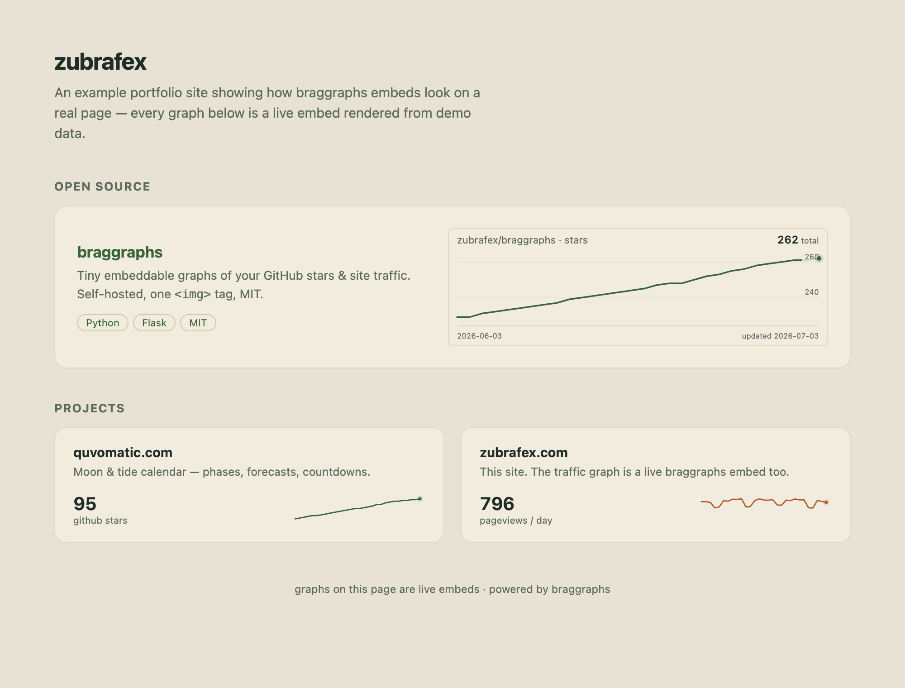
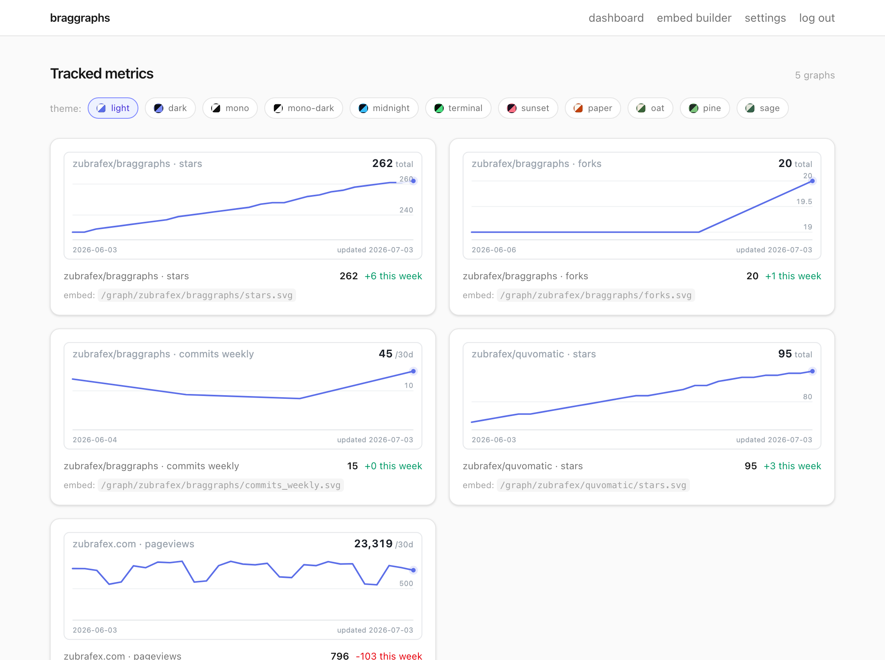
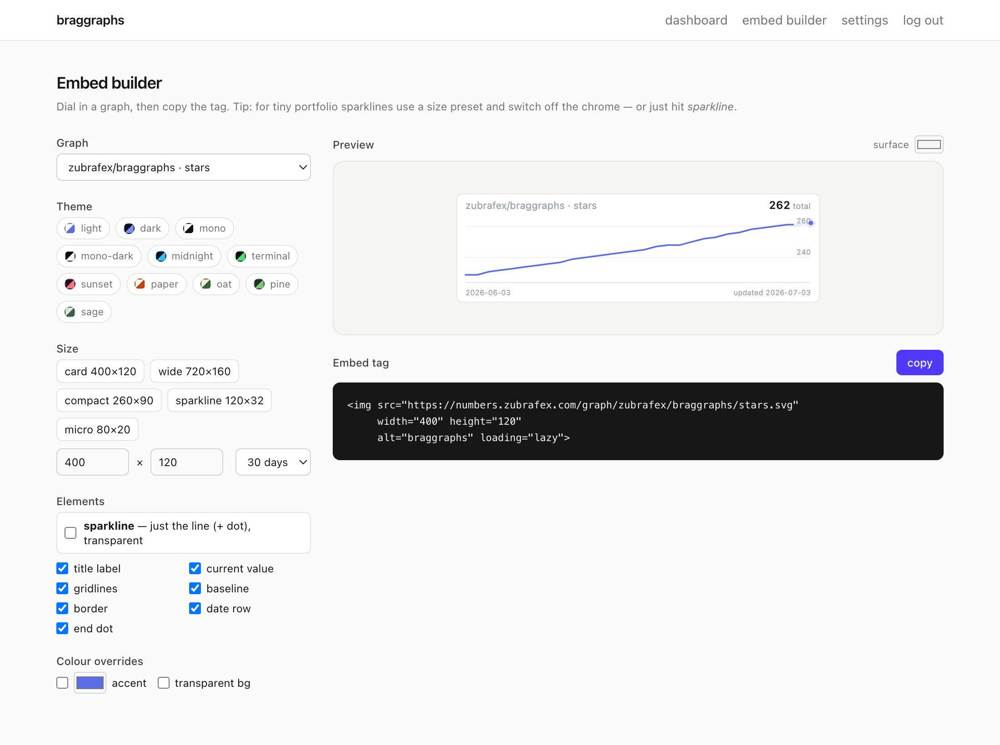

# braggraphs

[](https://github.com/orajb/braggraphs/actions/workflows/ci.yml)

Tiny, embeddable graphs of your GitHub stars (and your site traffic) for indie
makers who want to show their numbers without paying for a dashboard.



*A portfolio page with three live braggraphs embeds — a full star-history
card and two sparklines, all styled to the site's palette via query params.*

braggraphs is a self-hostable service that pulls project metrics daily, stores
them in SQLite, and renders them as clean ~3KB SVG line charts you can drop
into any site with a single `` tag:

```html

```

**Three connectors:**

- **GitHub** — stars, forks, open issues, weekly commits (via a personal access token)
- **Google Analytics (GA4)** — pageviews, sessions, active users (via a service-account key)
- **Cloudflare Web Analytics** — visits, pageviews, **bot traffic excluded by
  design** (via an Analytics-Read API token)

No JS for consumers. No chart libraries. MIT licensed. It's plain
Python 3.11+ with a SQLite file — `pip install`, one gunicorn command, and
you're running. Prefer containers? `docker-compose up` works too.

> **Deploying with an AI agent?** Point it at this repo — [AGENTS.md](AGENTS.md)
> is a first-class deploy guide it can follow end-to-end, and
> `python -m core.doctor` gives it a machine-checkable install verifier.

## Why braggraphs

If you've tried to put a *live star history chart* on your site, you've met
the alternatives:

| | history graph | embeddable | self-hosted / ad-free |
|---|---|---|---|
| **shields.io badges** | ✗ current value only | ✓ | ✓ |
| **GitHub's star graph** | ✓ | ✗ full-page only | — |
| **star-history.com** | ✓ | ✓ | ✗ ads, external service |
| **dashboard SaaS** | ✓ | ✗ no clean per-metric embeds | ✗ |
| **braggraphs** | ✓ (with backfill) | ✓ one `` tag | ✓ MIT, your server, your data |

braggraphs is the missing quadrant: a self-hosted, embeddable,
history-keeping graph of your GitHub stars (and GA4 traffic) — shields.io
simplicity with star-history depth, styled to match your site.

## Quickstart

> **[SETUP.md](SETUP.md) is the full onboarding** — every click-path (GitHub
> token, optional GA4 service account) plus a preflight check, ~10 minutes.
> The condensed version:

1. **Clone**

   ```sh
   git clone https://github.com/orajb/braggraphs && cd braggraphs
   ```

2. **Secrets** — copy `.env.example` to `.env` and fill it in:

   ```sh
   cp .env.example .env
   ```

   - `GITHUB_PAT` — a [personal access token](https://github.com/settings/tokens);
     for public repos a classic token with **no scopes** (or a fine-grained
     token with "Public repositories read-only") is enough — braggraphs
     only reads.
   - `BRAGGRAPHS_ADMIN_PASSWORD` — anything you like; gates `/admin`.
   - `GOOGLE_APPLICATION_CREDENTIALS` — only if you use GA4 (see below).

3. **Config** — copy `config.yml.example` to `config.yml` and list your repos:

   ```yaml
   github:
     repos:
       - owner: you
         repo: your-project
         metrics: [stars, forks, commits_weekly]
   ```

4. **Preflight + run** — the doctor verifies your tokens, repo names, and GA4
   grants before anything launches, with a fix hint per failing line:

   ```sh
   python3 -m venv .venv && .venv/bin/pip install -r requirements.txt
   .venv/bin/python -m core.doctor
   .venv/bin/gunicorn -w 1 --threads 4 -b 0.0.0.0:8000 'app:create_app(start_scheduler=True)'
   curl http://localhost:8000/healthz
   ```

   **Or with Docker** (identical behavior — same `.env`, same `./data`):

   ```sh
   docker compose run --rm braggraphs python -m core.doctor
   docker-compose up -d
   ```

   The scheduler fetches immediately on boot — including a one-time historic
   backfill of your full star history — so graphs aren't empty on day one.

5. **Embed** — paste into your site:

   ```html
   
   ```

   Swap `localhost:8000` for your public hostname once exposed (reverse proxy
   or Cloudflare Tunnel).

## Graph URLs

```
GET /graph/{owner}/{repo}/{metric}.svg         GitHub metrics
GET /graph/ga4/{label}/{metric}.svg            GA4 metrics (label from config.yml)
GET /graph/cloudflare/{label}/{metric}.svg     Cloudflare metrics (label from config.yml)
GET /embed/{owner}/{repo}/{metric}             iframe-friendly HTML wrapper
```

Query params:

| param | values | default |
|---|---|---|
| `w`, `h` | pixels (down to `40×16` for sparklines) | `400×120` |
| `theme` | `light` `dark` `mono` `mono-dark` `midnight` `terminal` `sunset` `paper` `oat` `pine` `sage` | `light` |
| `period` | `30d` \| `90d` \| `1y` \| `all` — the look window | `30d` |
| `window` | flow metrics only: value readout = sum of the trailing N days (`/Nd`); `0` = last single day (`/day`) | `30` |
| `accent` | hex line colour (`accent=b15a2b`) — overrides the theme | theme accent |
| `bg` | hex background, or `transparent` to sit on any surface | theme bg |
| `sparkline` | `1` — just the line + end dot, transparent, no chrome | off |
| `label` `value` `grid` `baseline` `dot` `dates` `border` | `0` removes that element individually | all on |

Examples:

```
…/stars.svg?theme=dark&period=90d&w=600&h=160        full card, dark
…/stars.svg?sparkline=1&w=120&h=32&accent=3a643a     tiny portfolio sparkline
…/stars.svg?grid=0&dates=0&bg=transparent            minimal, blends into the page
```

Pick the nearest theme, then nudge `accent`/`bg` to match your site exactly —
or use the **embed builder** at `/admin/builder` to dial it in visually and
copy the tag.

Responses are cached server-side for 5 minutes and rate-limited to
60 req/min per IP. Metrics with no data yet render a "no data yet"
placeholder instead of erroring.

## GitHub metrics

| metric | kind | history |
|---|---|---|
| `stars` | cumulative total | full history backfilled from the stargazers API on first fetch (best-effort, capped at 40k stars) |
| `forks` | cumulative total | builds from day one |
| `open_issues` | cumulative total | builds from day one |
| `commits_weekly` | per-week flow | last 52 weeks backfilled |

## GA4 setup (optional)

GA4 is the heaviest setup step — skip it entirely if you only want GitHub
graphs. One-time, ~5 minutes: create a GCP service account + JSON key, enable
the Analytics Data + Admin APIs, and grant the account **Viewer** on your GA4
property. The exact click-path is **[SETUP.md step 4](SETUP.md)**. Then list
your properties instead of hunting numeric IDs:

```sh
docker compose run --rm braggraphs flask ga4-properties
```

On the first fetch of a new property, braggraphs backfills the last **365
days** of traffic in one call — GA4 retains history, so your graphs start full.
Daily fetches record the previous *complete* day, never today's partial count.

## Cloudflare Web Analytics setup (optional)

The lightest-weight traffic source — no service accounts, one token. Numbers
come from Cloudflare's **Web Analytics beacon**, which only fires in real
browsers, so **bot and crawler traffic is excluded by construction** (this is
also why braggraphs uses it instead of zone request analytics, which count
every bot hit).

1. Make sure [Web Analytics](https://developers.cloudflare.com/web-analytics/)
   is enabled for your site (free — one click for Cloudflare-proxied zones
   under **Analytics → Web Analytics**).
2. Create an API token at
   [dash.cloudflare.com/profile/api-tokens](https://dash.cloudflare.com/profile/api-tokens):
   Custom token → permission **Account · Account Analytics · Read**. Put it in
   `.env` as `CLOUDFLARE_API_TOKEN`.
3. Your `account_id` is the 32-char hex in your dashboard URL. Then list your
   site tags instead of hunting for them:

   ```sh
   docker compose run --rm braggraphs flask cf-sites
   ```

   and copy the picks into the `cloudflare:` block of `config.yml`
   (metrics: `visits`, `pageviews`).

Backfill seeds up to **90 days** on first fetch (the Web Analytics API caps
queries at a ~13-week window); after that, graphs grow daily — each fetch
records the previous complete day.

## Admin dashboard

`/admin` (password from `BRAGGRAPHS_ADMIN_PASSWORD`) shows a tile grid of every
tracked metric — each tile is the exact public graph plus current value and
week-over-week delta, with a one-click theme switcher to preview any palette.
`/admin/builder` is an interactive embed builder: pick a graph, theme, size
preset (down to 80×20 micro sparklines), toggle individual elements, override
the accent colour, and copy the finished `` tag. `/admin/settings` shows
per-repo fetch status, last errors, and a **Fetch now** button.





## Exposing it

Any reverse proxy works (braggraphs respects `X-Forwarded-For`). Two common
paths:

- **Caddy/nginx** — proxy your subdomain to `localhost:8000`.
- **Cloudflare Tunnel** — add a public hostname (e.g. `numbers.example.com`)
  pointing at `http://localhost:8000`; no open ports needed.

## Behavior notes

- **Daily cadence** by default; failed fetches back off 1h → 4h → 24h, and one
  failing repo never blocks the others.
- Metrics are stored one row per `(project, metric, day)` — refetches and
  backfills upsert, so nothing ever duplicates.
- Secrets live in env vars only: never in `config.yml`, the DB, or logs.
- Everything (SQLite DB, generated session key) lives in the `./data` volume —
  back that folder up and you've backed up braggraphs.

## Development

```sh
python3 -m venv .venv && .venv/bin/pip install -r requirements-dev.txt
.venv/bin/pytest                # 61 tests, no network needed
GITHUB_PAT=… BRAGGRAPHS_ADMIN_PASSWORD=… .venv/bin/python app.py
```

Want to add a connector (Cloudflare, Stripe, Plausible…)? It's a single file —
see [CONTRIBUTING.md](CONTRIBUTING.md).

## Acknowledgements

braggraphs exists because [@hakanu](https://github.com/hakanu) planted the
idea — thanks, Hakan.

## License

[MIT](LICENSE)
